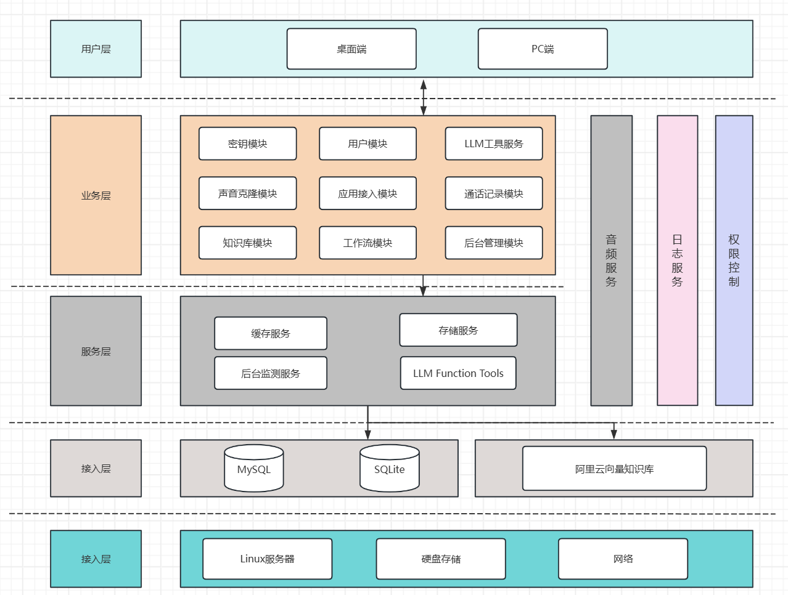
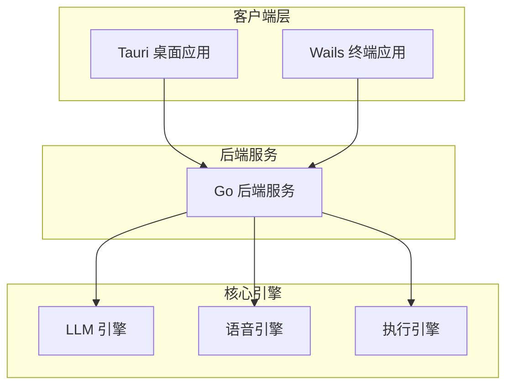
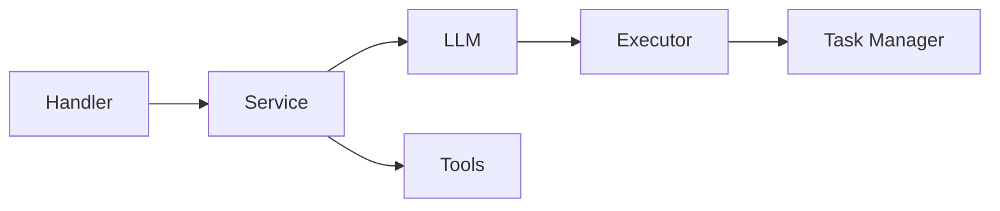
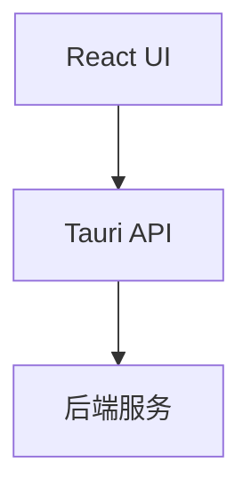
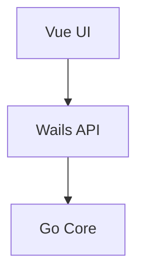
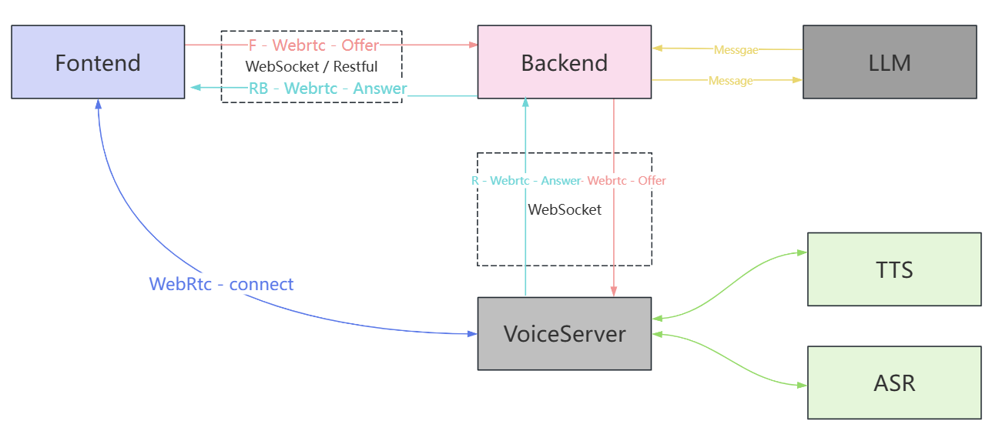
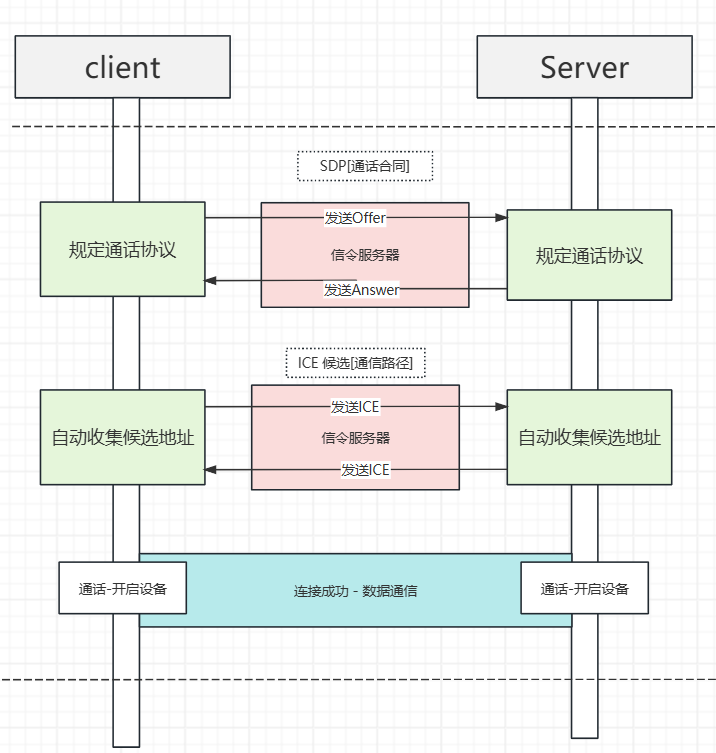
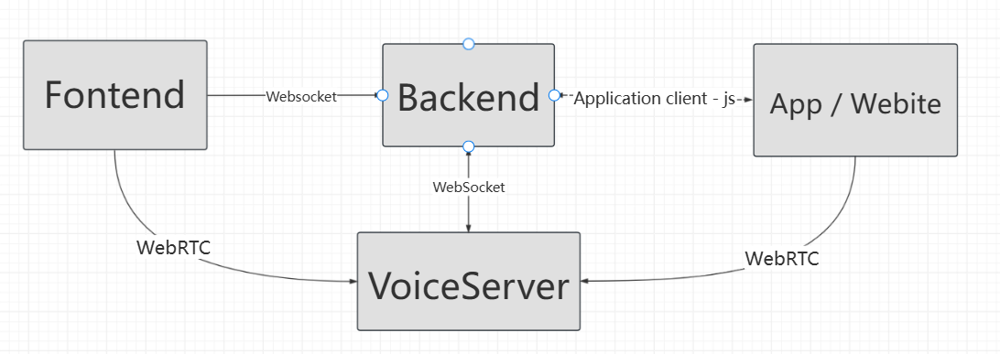
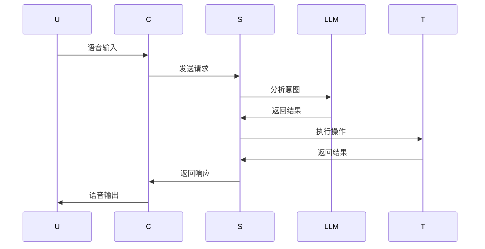
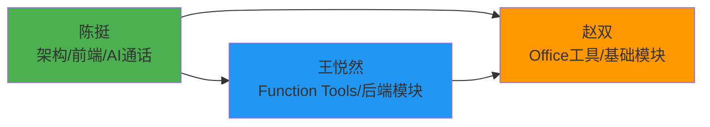

# VoicePilotCore 架构设计文档

## 项目概述

VoicePilotCore 是一个智能语音控制电脑助手，包含三个主要部分：

1. **后端服务** (Go + Gin)
2. **桌面端应用** (Tauri + React)  
3. **终端应用** (Wails + Vue)

## 整体架构

### 架构图

### 局部架构

## 第一部分：后端架构

### 核心模块

- **Handler**: API 请求处理
- **Service**: 业务逻辑
- **LLM**: 大模型集成 (DeepSeek)
- **Tools**: Function Tools (系统控制/文件操作)
- **Executor**: 智能执行器
- **Task Manager**: 任务编排

## 第二部分：桌面端架构

### 技术栈

- React 18 + TypeScript
- Tauri 2.0
- Zustand 状态管理
- Tailwind CSS

## 第三部分：终端架构

### 技术栈

- Vue 3 + TypeScript  
- Wails
- Pinia 状态管理

## 数据流

### 工作流程图

### 语音通信流程

### 桌面宠物交互流程

### Mermaid 序列图

## 团队分工

### 成员介绍

- **陈挺** - 整体架构设计与核心前后端开发
- **王悦然** - 后端模块与 Function Tools 开发
- **赵双** - Office 三件套 LLM 操作工具与后端基础模块

### 具体分工

#### 陈挺

**负责模块**：
- 整体架构设计与技术选型
- 前后端联调与集成
- AI 通话功能实现
- Function Tools 核心框架设计
- WebRTC 实时语音通信
- 桌面端应用开发

**主要贡献**：
- 项目整体架构设计
- 前后端通信协议设计和多种AI语音通话方式的实现
- LLM 集成与调用逻辑
- 语音识别与合成集成
- 桌面宠物功能开发

#### 王悦然

**负责模块**：
- Go 后端核心模块开发
- Function Tools 具体实现
- 系统控制相关工具
- 多媒体控制功能
- 文件操作工具
- 终端应用开发

**主要贡献**：
- 后端服务架构实现
- Function Tools 体系设计
- 系统 API 集成与封装
- 终端应用功能开发
- 任务调度与编排

#### 赵双

**负责模块**：
- Office 三件套（Word/Excel/PowerPoint）LLM 操作工具
- 后端基础模块开发
- 文档处理与格式化
- 模板管理功能
- 文件 I/O 操作

**主要贡献**：
- Office 文档处理工具开发
- Word/Excel/PPT 的操作封装
- AI 辅助文档生成功能
- 模板系统设计与实现
- 文件存储与管理

### 协作方式

